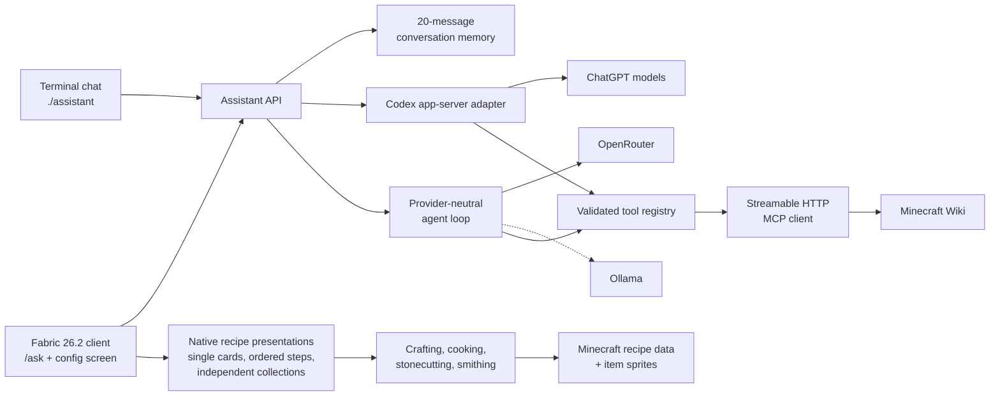

# Minecraft Assistant

A client-side Minecraft AI assistant with a provider-neutral Java harness and live Minecraft Wiki tools.

The project currently supports:

- a provider-neutral asynchronous agent loop;
- structured tool calls with validation, limits, cancellation, and timeouts;
- ChatGPT authentication through the official Codex app-server;
- OpenRouter as the distributable mod's first production provider;
- live Minecraft Wiki tools through MCP;
- a concise terminal interface for development;
- a client-only Fabric 26.2 mod with `/ask`, conversation memory, cancellation, timing, clickable sources, and native production-method diagrams;
- an in-game OpenRouter configuration screen; and
- unit, HTTP contract, and real-client creative-world tests.

## System design

Solid lines are implemented today; dashed lines are planned integration points.



Minecraft/Fabric code remains at the outer edge. Provider adapters, conversation logic, and Wiki tooling do not depend on Minecraft classes, allowing them to be tested independently and reused across Minecraft versions.

## Install the mod

The current development build targets Minecraft 26.2 with Fabric Loader 0.19.5, Fabric API 0.160.0+26.2, and Java 25. See [the installation guide](docs/INSTALLATION.md) for Prism Launcher and the standard Minecraft launcher.

Once installed, join a local world and run:

```text
/ask config
/ask how do I craft a recovery compass?
```

The mod stores up to 20 recent user and assistant messages in memory for follow-up questions. `/ask clear` resets that context and `/ask stop` cancels the active request.
Crafting, cooking, stonecutting, and smithing answers can include a compact **Show Recipe** action. Connected production questions such as “How do I go from sand to glass panes?” use one **Show N Steps** action with an ordered, navigable process; several unrelated recipe requests use **Show N Recipes**. Every card combines Minecraft's native recipe data with its actual workstation textures, slot positions, progress sprites, item renderer, and active resource pack. Cooking cards leave the fuel slot generic, while time and XP remain available from the progress-arrow tooltip instead of cluttering the card.

## Development prerequisites

- Java 21 or newer for the standalone harness
- Java 25 for Fabric 26.2 development
- the Codex CLI, signed in with ChatGPT (`codex login`), for the terminal interface
- internet access for the selected provider and the default Wiki MCP endpoint

The checked-in Gradle wrapper downloads the pinned Gradle version. No system Gradle installation is needed.

The ChatGPT adapter uses the official [Codex app-server](https://learn.chatgpt.com/docs/app-server). Its client-owned dynamic tool API is experimental, so this integration is isolated in its own module.

## Run

For the interactive terminal interface:

```sh
./assistant
```

Type Minecraft questions directly at the prompt. The most recent 20 user and assistant messages are supplied as context, so follow-up questions work; `/clear` resets that memory. Use `/help` to see the terminal commands and `/quit` to exit. The interface keeps the ChatGPT and Wiki connections open and shows the elapsed time and Wiki tool-call count for every answer.

Responses default to one to three short plain-text sentences suitable for Minecraft chat. Wiki-backed answers end with an unformatted source URL; the Fabric layer renders it as a compact clickable source component.

For one-shot development commands:

```sh
./gradlew test
./gradlew :cli:run --args=doctor
./gradlew :cli:run --args=models
./gradlew :cli:run --args='ask how do I obtain a heart of the sea?'
```

Live smoke tests:

```sh
# Verifies ChatGPT can call a client-owned tool.
./gradlew :cli:run --args=smoke

# Verifies ChatGPT can retrieve and cite Minecraft Wiki information.
./gradlew :cli:run --args=wiki-smoke
```

Fabric build and real-client test:

```sh
./gradlew :fabric:build
./gradlew :fabric:runClientGameTest
```

The client game test creates and removes an isolated local creative world. Set `MINECRAFT_ASSISTANT_OPENROUTER_API_KEY` to include a live OpenRouter request and native recipe-tool call; without it, the test still verifies local command interception, the configuration screen, and recipe rendering.

Configuration is read from the environment:

| Variable | Default |
| --- | --- |
| `MINECRAFT_ASSISTANT_MODEL` | `gpt-5.6-luna` |
| `MINECRAFT_ASSISTANT_REASONING_EFFORT` | `medium` |
| `MINECRAFT_ASSISTANT_WIKI_MCP_URL` | `https://minecraft-wiki-mcp.goett.top/mcp` |

Only HTTPS MCP endpoints are accepted, except loopback HTTP endpoints for local development. The default Wiki endpoint is a third-party service; it receives Wiki tool names and arguments, not ChatGPT credentials. The Codex CLI owns ChatGPT authentication, and this project does not read or store its tokens.

## Security

- Never commit provider keys, OAuth tokens, `.env` files, or Minecraft credentials.
- The current ChatGPT development adapter delegates authentication to the Codex CLI and does not read its tokens.
- The Fabric mod masks the OpenRouter key in its UI and stores it in a separate per-instance credentials file with owner-only permissions where the filesystem supports them.
- Tool names and arguments may be sent to the configured MCP endpoint; provider credentials are not.
- Model and tool output are treated as untrusted data and cannot register new tools or execute shell commands.
- The default public Wiki MCP endpoint is third-party infrastructure and can be replaced through configuration.

## Modules

- `assistant-core` — provider-neutral messages, conversation memory, tools, agent loop, limits, and errors
- `provider-codex` — isolated ChatGPT/Codex app-server adapter
- `provider-openrouter` — direct OpenRouter HTTP adapter, tool-call mapping, and model discovery
- `tool-mcp` — generic Streamable HTTP MCP client and tool mapping
- `cli` — development and smoke-test entry point
- `fabric` — Minecraft 26.2 client commands, settings UI, chat rendering, packaging, and client game tests

See [SPEC.md](SPEC.md) for the researched product and implementation specification. The next milestone is hardening the current alpha in a normal Prism installation, improving model selection, and preparing release automation.
