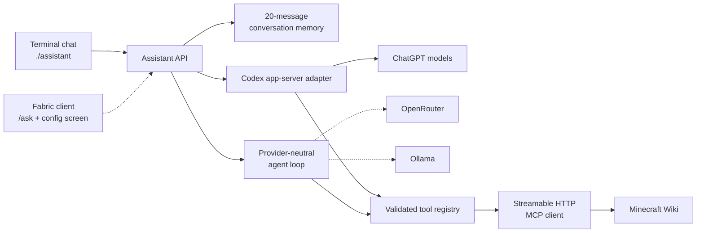

# Minecraft Assistant

A client-side Minecraft AI assistant, beginning with a small provider-neutral Java harness and live Minecraft Wiki tools.

The first implemented slice runs outside Minecraft so the model/tool loop can be tested thoroughly before Fabric integration. It currently supports:

- a provider-neutral asynchronous agent loop;
- structured tool calls with validation, limits, cancellation, and timeouts;
- ChatGPT authentication through the official Codex app-server;
- GPT-5.6 Luna with medium reasoning by default;
- live Minecraft Wiki tools through MCP;
- a CLI and automated tests for development.

The Fabric mod and `/ask` command are deliberately not implemented yet.

## System design

Solid lines are implemented today; dashed lines are planned integration points.



Minecraft/Fabric code will remain at the outer edge. Provider adapters, conversation logic, and Wiki tooling do not depend on Minecraft classes, allowing them to be tested independently and reused across Minecraft versions.

## Prerequisites

- Java 21 or newer
- the Codex CLI, signed in with ChatGPT (`codex login`)
- internet access for ChatGPT and the default Wiki MCP endpoint

The checked-in Gradle wrapper downloads the pinned Gradle version. No system Gradle installation is needed.

The ChatGPT adapter uses the official [Codex app-server](https://learn.chatgpt.com/docs/app-server). Its client-owned dynamic tool API is experimental, so this integration is isolated in its own module.

## Run

For the interactive terminal interface:

```sh
./assistant
```

Type Minecraft questions directly at the prompt. The most recent 20 user and assistant messages are supplied as context, so follow-up questions work; `/clear` resets that memory. Use `/help` to see the terminal commands and `/quit` to exit. The interface keeps the ChatGPT and Wiki connections open and shows the elapsed time and Wiki tool-call count for every answer.

Responses default to one to three short plain-text sentences suitable for Minecraft chat. Wiki-backed answers end with an unformatted source URL; the future Fabric layer can render that URL as a compact clickable text component.

For one-shot development commands:

```sh
./gradlew test
./gradlew :cli:run --args=doctor
./gradlew :cli:run --args=models
./gradlew :cli:run --args='ask how do I obtain a heart of the sea?'
```

Live smoke tests:

```sh
# Verifies ChatGPT can call a client-owned tool.
./gradlew :cli:run --args=smoke

# Verifies ChatGPT can retrieve and cite Minecraft Wiki information.
./gradlew :cli:run --args=wiki-smoke
```

Configuration is read from the environment:

| Variable | Default |
| --- | --- |
| `MINECRAFT_ASSISTANT_MODEL` | `gpt-5.6-luna` |
| `MINECRAFT_ASSISTANT_REASONING_EFFORT` | `medium` |
| `MINECRAFT_ASSISTANT_WIKI_MCP_URL` | `https://minecraft-wiki-mcp.goett.top/mcp` |

Only HTTPS MCP endpoints are accepted, except loopback HTTP endpoints for local development. The default Wiki endpoint is a third-party service; it receives Wiki tool names and arguments, not ChatGPT credentials. The Codex CLI owns ChatGPT authentication, and this project does not read or store its tokens.

## Security

- Never commit provider keys, OAuth tokens, `.env` files, or Minecraft credentials.
- The current ChatGPT development adapter delegates authentication to the Codex CLI and does not read its tokens.
- Tool names and arguments may be sent to the configured MCP endpoint; provider credentials are not.
- Model and tool output are treated as untrusted data and cannot register new tools or execute shell commands.
- The default public Wiki MCP endpoint is third-party infrastructure and can be replaced through configuration.

## Modules

- `assistant-core` — provider-neutral messages, conversation memory, tools, agent loop, limits, and errors
- `provider-codex` — isolated ChatGPT/Codex app-server adapter
- `tool-mcp` — generic Streamable HTTP MCP client and tool mapping
- `cli` — development and smoke-test entry point

See [SPEC.md](SPEC.md) for the researched product and implementation specification. The next major milestone is adding a Fabric client integration that delegates to these Minecraft-independent modules without blocking Minecraft's main thread.
