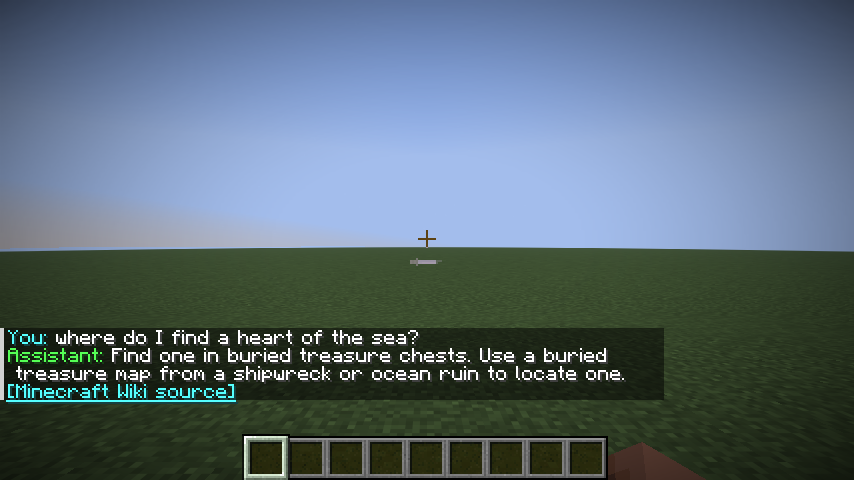
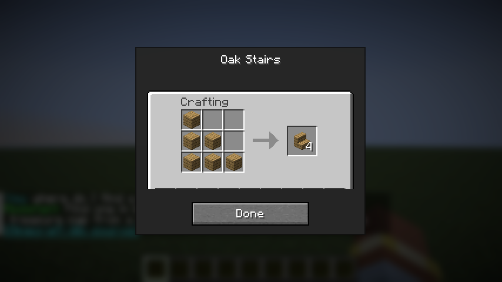
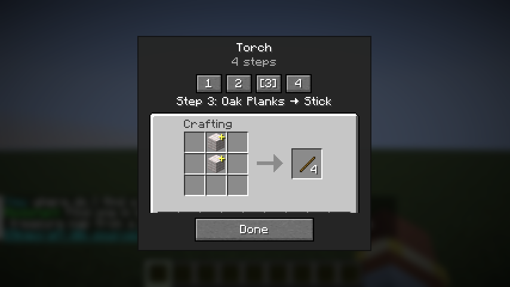
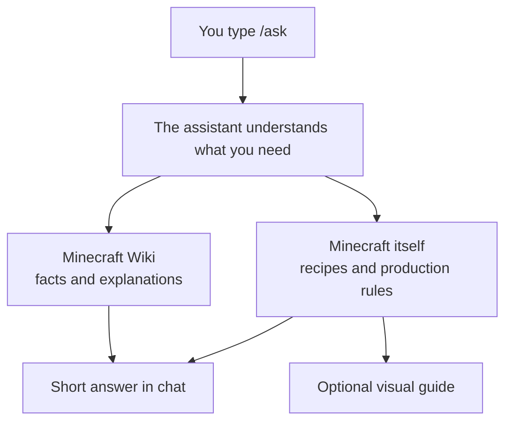

# Minecraft Assistant

Ask Minecraft questions without leaving the game.

Type `/ask`, get a short answer in chat, and open a visual recipe or production guide when one would help. Minecraft Assistant is a client-side Fabric mod, so the server does not need to install anything.

> **Project status:** Early alpha. The current development build targets Minecraft 26.2 and uses OpenRouter for in-game AI access. A normal downloadable release is not published yet.



## What can it do?

- Answer Minecraft questions directly in chat.
- Search Minecraft Wiki when a factual or version-specific answer needs a reliable source.
- Show recipes using Minecraft's real recipe data instead of asking the AI to guess.
- Walk through connected steps such as logs → planks → sticks → torches.
- Calculate exact material totals, batches, and leftovers for quantity questions.
- Remember the last ten exchanges, so follow-up questions can refer to what you just asked.
- Keep running entirely on the client in single-player and multiplayer.

Try questions such as:

```text
/ask where do I find a heart of the sea?
/ask how do I make a recovery compass?
/ask how many logs do I need for 128 oak stairs?
/ask I don't have a stonecutter. What can I do instead?
/ask how do I make torches if I only have logs and a furnace?
```

| Native recipe | Multi-step guide |
| :---: | :---: |
|  |  |

The guide screens are read-only. They use Minecraft's own items, recipes, workstation layouts, and active resource pack.

## Install and start

Minecraft Assistant currently needs:

- Minecraft 26.2
- Fabric Loader
- Fabric API
- the Minecraft Assistant JAR
- an OpenRouter account and API key

The easiest current setup is Prism Launcher:

1. Add Fabric and Fabric API to a Minecraft 26.2 instance.
2. Add the Minecraft Assistant JAR to that instance's mods.
3. Launch Minecraft and enter a world.
4. Create an account at [OpenRouter](https://openrouter.ai/), then create a key on the
   [OpenRouter API Keys](https://openrouter.ai/settings/keys) page.
5. Run `/ask config` in Minecraft.
6. Paste the secret key into **OpenRouter API key**. In **Model**, enter
   `openai/gpt-5.6-luna` (or copy another tested ID from the table below). The model ID is not a URL
   or a second key.
7. Leave reasoning on **low**, select **Test Connection**, then **Save**.
8. Try `/ask how do I make a compass?`.

See the [complete installation guide](docs/INSTALLATION.md) for detailed Prism Launcher instructions, the standard Minecraft launcher, configuration, and troubleshooting.

## Which model should I use?

Start with **GPT-5.6 Luna on low reasoning**. It gave the best balance of accuracy, tool use, speed, and cost in the
project's reproducible 20-question test.

| Provider | Model | Reasoning | Model ID to paste | Score | ~prompts/$ | Avg. latency |
| --- | --- | --- | --- | ---: | ---: | ---: |
| OpenAI | [GPT-5.6 Luna](https://openrouter.ai/openai/gpt-5.6-luna) **(Recommended)** | Low | `openai/gpt-5.6-luna` | 98/100 | ~3,700 | 2.98s |
| OpenAI | [GPT-5.6 Luna](https://openrouter.ai/openai/gpt-5.6-luna) | High | `openai/gpt-5.6-luna` | 97/100 | ~3,000 | 4.11s |
| OpenAI | [GPT-5.6 Sol](https://openrouter.ai/openai/gpt-5.6-sol) | Low | `openai/gpt-5.6-sol` | 97/100 | ~380 | 3.71s |
| OpenAI | [GPT-5.6 Sol](https://openrouter.ai/openai/gpt-5.6-sol) | High | `openai/gpt-5.6-sol` | 98/100 | ~360 | 3.80s |
| OpenAI | [GPT-5 Mini](https://openrouter.ai/openai/gpt-5-mini) | Low | `openai/gpt-5-mini` | 78/100 | ~1,400 | 4.43s |
| OpenAI | [GPT-5 Nano](https://openrouter.ai/openai/gpt-5-nano) | Low | `openai/gpt-5-nano` | 26/100 | ~4,200 | 7.59s |
| Anthropic | [Claude Haiku 4.5](https://openrouter.ai/anthropic/claude-haiku-4.5) | Low | `anthropic/claude-haiku-4.5` | 82/100 | ~120 | 2.13s |
| Anthropic | [Claude Haiku 4.5](https://openrouter.ai/anthropic/claude-haiku-4.5) | High | `anthropic/claude-haiku-4.5` | 80/100 | ~120 | 2.19s |
| Anthropic | [Claude Opus 5](https://openrouter.ai/anthropic/claude-opus-5) | Low | `anthropic/claude-opus-5` | 97/100 | ~18 | 5.90s |
| Anthropic | [Claude Opus 5](https://openrouter.ai/anthropic/claude-opus-5) | High | `anthropic/claude-opus-5` | 98/100 | ~17 | 7.32s |
| Google | [Gemini 3.8 Flash](https://openrouter.ai/google/gemini-3.8-flash) | Low | `google/gemini-3.8-flash` | 97/100 | ~270 | 2.90s |
| DeepSeek | [DeepSeek V4.1 Flash](https://openrouter.ai/deepseek/deepseek-v4.1-flash) | Low | `deepseek/deepseek-v4.1-flash` | 95/100 | ~3,400 | 10.62s |
| Inception | [Mercury 2.5](https://openrouter.ai/inception/mercury-2.5) | Low | `inception/mercury-2.5` | 85/100 | ~2,900 | 2.05s |

Tested September 21, 2026 with 20 questions per model and reasoning setting. A “prompt” here means one
complete player question, including any extra model turns needed to use tools. Prices, routing, and
model behavior can change, so the cost figures are approximate. See the
[benchmark methodology](benchmarks/README.md) to reproduce the test; bulky raw transcripts stay
local and are not committed.

## How it works



The AI decides what would help answer the question. It can respond directly, look up a fact on Minecraft Wiki, or ask the mod to prepare a native production guide.

Minecraft itself remains the authority for recipes and production rules. The mod discovers the real steps and performs exact quantity calculations in Java; the AI does not invent recipe layouts or do the final arithmetic.

When several genuinely different routes exist, the assistant can select the one that best fits the question and recent conversation. For example, it can prefer crafting after a follow-up such as “I don't have a stonecutter.”

## Commands

| Command | What it does |
| --- | --- |
| `/ask <question>` | Ask a Minecraft question |
| `/ask config` | Open provider and model settings |
| `/ask stop` | Cancel the active request |
| `/ask clear` | Forget recent conversation history |
| `/ask help` | Show the in-game command guide |

If a multiplayer server already owns `/ask`, use `/mcai ask <question>` instead.

The assistant remembers up to 20 recent user and assistant messages—about ten complete exchanges. That memory stays in RAM, resets when you leave the current world or server, and can be cleared manually with `/ask clear`.

## Native guides

Minecraft Assistant can currently prepare visual guides for:

- shaped and shapeless crafting;
- furnace, blast furnace, smoker, and campfire cooking;
- stonecutting and smithing;
- brewing;
- loom patterns;
- map scaling, cloning, and locking;
- enchanting-table eligibility;
- anvil operations; and
- grindstone operations.

Dynamic systems are handled conservatively. The mod does not promise a particular enchanting offer, fabricate an unknown anvil cost, or claim that a grindstone removes curses.

## Providers, privacy, and cost

OpenRouter is the provider supported inside the mod today. The selected model determines response quality, speed, and cost; inexpensive models generally make each question cost a small fraction of a cent, but prices are controlled by OpenRouter and model providers.

The mod has no Minecraft Assistant account or hosted backend:

- Questions and recent conversation are sent to the configured model provider.
- Wiki search terms and page names are sent directly to `minecraft.wiki/api.php`.
- The OpenRouter key is stored inside the individual Minecraft instance, separately from ordinary settings, and is masked in the configuration screen.
- Provider credentials are never sent to Minecraft servers or Minecraft Wiki.
- Wiki responses are cached in memory for ten minutes; conversation history and visual-guide links are not persisted.

## Minecraft Wiki attribution

Retrieved facts come from the community-run [Minecraft Wiki](https://minecraft.wiki/), whose content is available under [CC BY-NC-SA 3.0](https://creativecommons.org/licenses/by-nc-sa/3.0/). Wiki-backed answers retain a clickable source link. Minecraft Wiki is not official Mojang or Microsoft documentation.

## Development

The project keeps the Minecraft integration, assistant harness, model providers, and Wiki client separate so most behavior can be tested without repeatedly launching a normal Minecraft world.

Requirements:

- Java 21 or newer for the shared Java modules
- Java 25 for Minecraft 26.2 development
- the checked-in Gradle wrapper

Useful commands:

```sh
./gradlew test
./gradlew :fabric:build
./gradlew :fabric:runClientGameTest
./gradlew :fabric:runUiPreview
./gradlew :fabric:runModelBenchmark
```

`runUiPreview` creates a disposable superflat test world, captures the visual guide gallery under `fabric/build/ui-previews/`, and exits automatically. It does not use provider credentials, Prism Launcher, an existing world, or computer control.

`runModelBenchmark` runs the tracked 20-question suite through OpenRouter without launching
Minecraft. See [benchmarks/README.md](benchmarks/README.md) for filters, resume behavior, scoring,
and report generation.

Project modules:

- `assistant-core` — conversations, tools, limits, cancellation, and the provider-neutral agent loop
- `provider-openrouter` — the in-game OpenRouter integration
- `tool-mediawiki` — direct Minecraft Wiki access
- `fabric` — commands, configuration, native guides, rendering, and Minecraft tests

See [SPEC.md](SPEC.md) for the researched product specification and [AGENTS.md](AGENTS.md) for repository working conventions.
